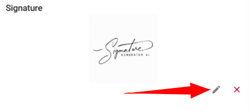
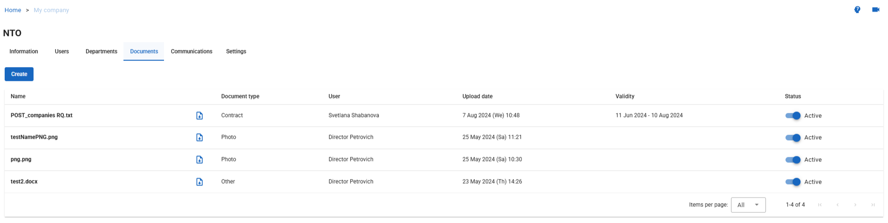
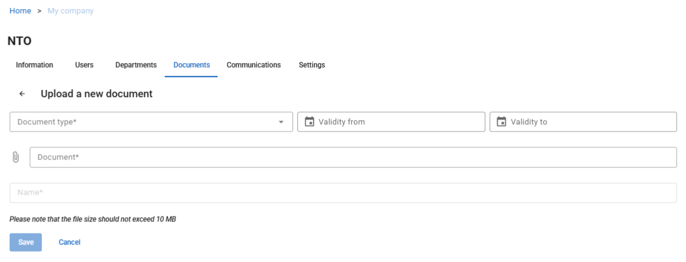

# Configure Company Information

Configure your company profile to ensure accurate information appears in invoices, vouchers, reports, and system notifications. Complete all mandatory fields marked with an asterisk (*).

## Access the Company Profile

1. Navigate to **My Company** > **My Company**.

   The **Information** page opens:

   

2. The page opens in editing mode by default.

## Required Information

Fill in the following sections with your company details. Click each section to expand it.

<strong>Details</strong>

Specify basic company information:

- **Name** - Enter your company name.
- **Type** - The company type is set by the platform administrator and cannot be modified.
- **Alias** - Create a memorable alternative to the system-generated company code. Use this alias to log in instead of the auto-generated code.

<strong>Address</strong>

Provide both physical and postal address details:

- **Country** - Select your country.
- **City** - Enter your city.
- **Region** - Enter your region or state.
- **Address** - Enter your physical street address.
- **Postal code** - Enter your postal or ZIP code.
- **Postal address** - If different from your physical address, enter your mailing address.

<strong>Contact Person</strong>

Specify the primary contact for system-related communications:

- **Full name of contact person** - Enter the name of the main person responsible for the system.
- **Phone number** - Enter the contact person's phone number.
- **Fax** - Enter the contact person's fax number.
- **E-mail** - Enter the contact person's email address. This email appears as the "from" address in notifications sent to clients and receives system notifications. You can use a department email (such as operations@yourcompany.com) instead of an individual address.

<strong>Additional Information</strong>

Provide legal and registration details:

- **Full name of legal entity** - Enter the complete legal name of your company for invoices and official documentation.
- **VAT number** - Enter your tax identification number.
- **IATA number** - If registered with the International Air Transportation Association (IATA), enter your IATA number.
- **Docex number** - If registered with Docex, enter your Docex number.
- **Company external code** - If you use external systems (such as SAP), enter the company code from that system for integration purposes.
- **KPP** - Enter your 9-digit code that identifies company branches (if applicable).

<strong>Comments</strong>

Enter any additional information about your company in the Comments text field.

<strong>Upload Company Logo</strong>

Upload your company logo to display on documents such as vouchers, invoices, and reports.

**Note:** This logo does not appear in the system header. To configure the header logo, see *Company Profile Settings*.

To upload a logo:

1. Navigate to **My Company** > **My Company**.
2. Click the **Edit** icon in the **Logo** section.
3. Browse to the image file you want to upload.
4. Click **Open**.

   The new logo uploads and displays in the Logo section.

<strong>Upload Signature</strong>

Upload an authorized signature to include on official documents.

To upload a signature:

1. Navigate to **My Company** > **My Company**.

   

2. Click the **Edit** icon in the **Signature** section.
3. Browse to the signature image file.
4. Click **Open**.

   The signature uploads and displays in the Signature section.

<strong>Upload Company Documents</strong>

Store important company documents in the system for easy access. Upload contracts, price lists, guarantee letters, and other business documents.

To upload a document:

1. Navigate to **My Company** > **My Company**.
2. Open the **Documents** tab.
   
3. Click **Create**.

   The **Upload New Document** window opens:

   
   
   

4. Add information about the document:

   - **Document type**: Select the type from the dropdown. If no suitable type exists, select **Other**.
   - **Validity period**: Set the start and end dates. These dates are informational only and do not trigger system actions.

5. Upload the document file:

   - Click the **Document** field.
   - Search for the document you want to upload.
   - Click **Open**.

6. Click **Save** to complete the upload, or **Cancel** to discard changes.

   The document appears in the **Documents** tab and is available for viewing and download.

