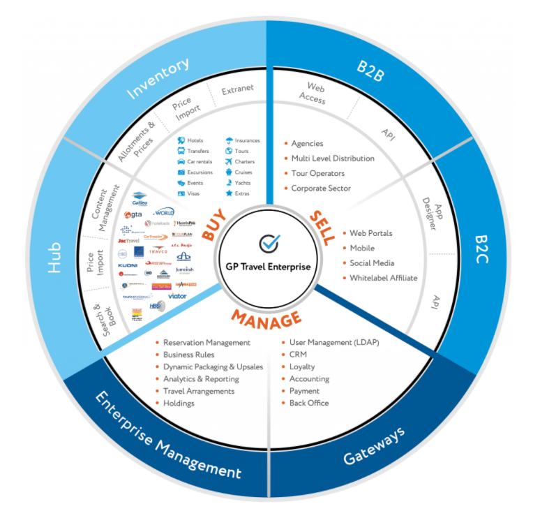

GP Travel Enterprise is a multifunctional modular platform that includes more than 100 modules. The architecture can be easily customized on demand to suit the requirements of various business models and covers such aspects as BUYING travel products from suppliers, SELLING them via B2B/B2C sales channels and MANAGING processes and reservations.

<figure><figcaption></figcaption></figure>

The modules of the system are combined into six independent components to solve the specific range of business tasks. All components and modules of the platform can be combined in many ways and also include scalability mechanisms for adaptation to business processes and unique needs.

| Component          | Business tasks                                                                                                                                                                                     |
| ------------------ | -------------------------------------------------------------------------------------------------------------------------------------------------------------------------------------------------- |
| HUB                | Provide a unified interface for integration with multiple travel suppliers.                                                                                                                        |
| INVENTORY          | Allows to manage own and directly-contracted inventory (prices, availability, descriptions, policies).                                                                                             |
| B2B                | Build up B2B distribution network.                                                                                                                                                                 |
| B2C                | Handles sales to end consumers.                                                                                                                                                                    |
| ENTERPRISE MANAGER | To provide a fully functional back-office solution for configuring markups & commissions & other sales rules, managing reservations, creating invoices, controlling payments and obtain analytics. |
| GATEWAYS           | Enhances business automation via integration with external systems (e.g. CRM, Accounting, online payment gateways etc.).                                                                           |
