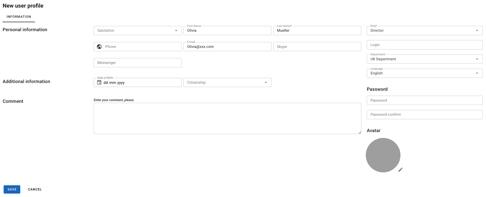

---
layout:
  width: default
  title:
    visible: true
  description:
    visible: false
  tableOfContents:
    visible: true
  outline:
    visible: true
  pagination:
    visible: true
  metadata:
    visible: true
---

# Creating New User

1. In the **My Company** menu, click **Users**.&#x20;
2. Then click **New User Profile**. The New User Profile page appears:

<figure><figcaption></figcaption></figure>

3. Fill in the required information. The fields that are to be filled mandatory are marked with the <mark style="background-color:red;">**\***</mark> symbol.

Among others, please pay attention to the following boxes:

* **Role**: the role determines the rights of a user in the system. For more information, please read section [**User Roles**](user-roles.md).
* **Login**: once created it cannot be changed.


Please pay attention that for logging in the system a user needs to enter a _company code_ (alias), a _user name_ and a _password_.



A company code (alias) is a unique code assigned to every company automatically to access the system. An alias is specified manually upon [**Configuring Information about the Company**](../../configuring-information-about-the-company.md)**.** For your convenience both the company code and alias are displayed within the user profile page to the right below the **Active** check box.


4. Click **Save.**
