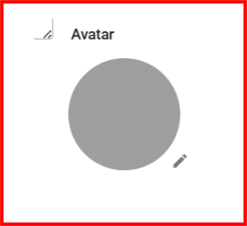

---
layout:
  width: default
  title:
    visible: true
  description:
    visible: false
  tableOfContents:
    visible: true
  outline:
    visible: true
  pagination:
    visible: true
  metadata:
    visible: true
---

# Uploading User Avatar

If you wish, you can customize user profiles with their avatars.

To upload a user avatar,

1. In the My Company menu click **Users**.
2. Open the required user profile and click **Edit** icon in the Avatar section.

<figure><figcaption></figcaption></figure>

1. Browse to the picture you want to upload.
2. Click **Open**, then **Save**.
