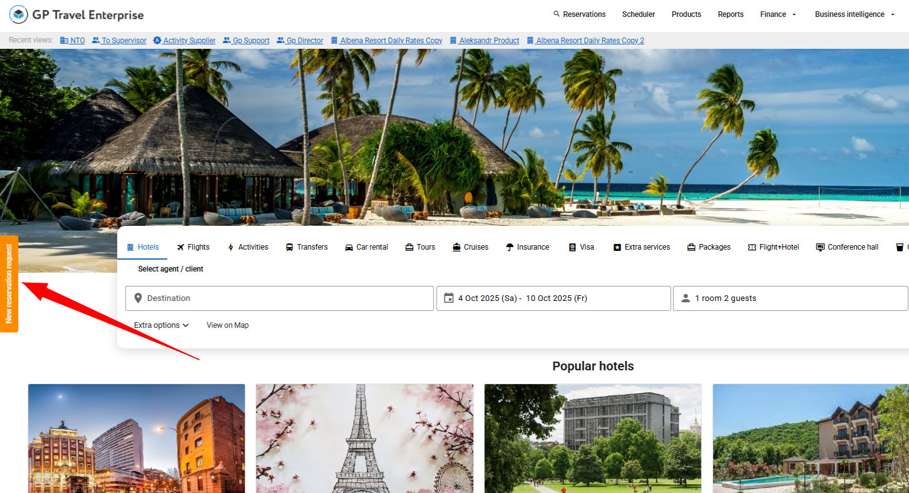
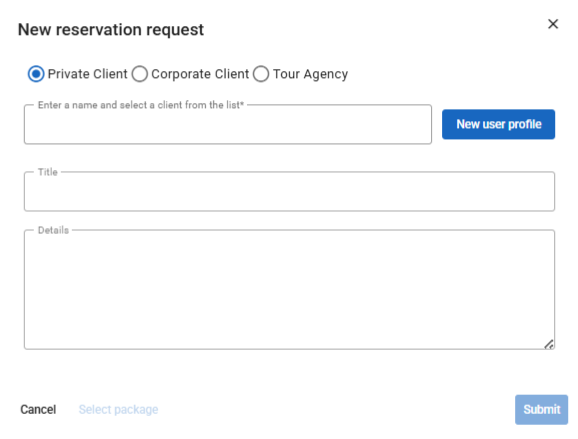
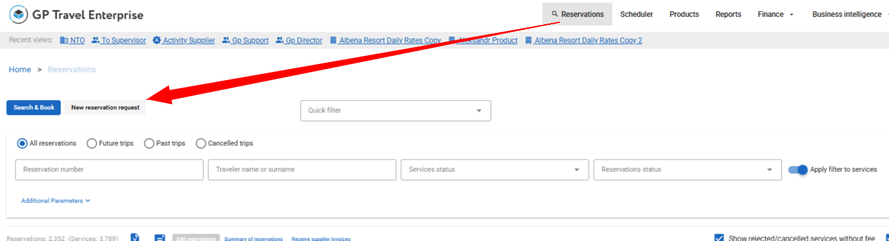
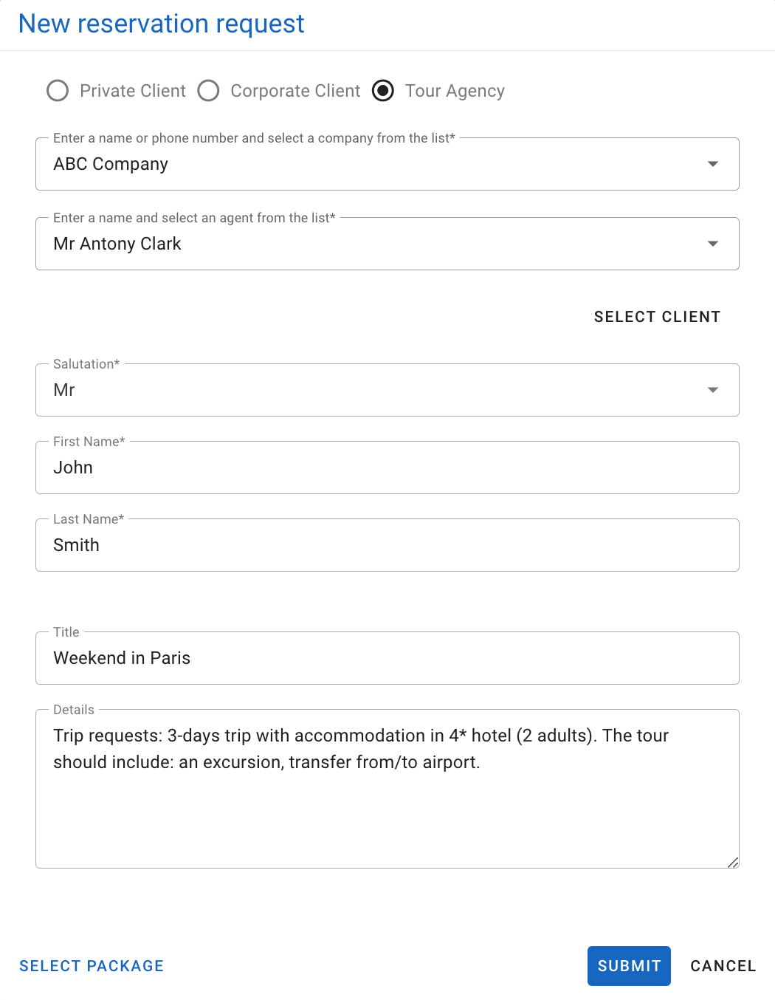
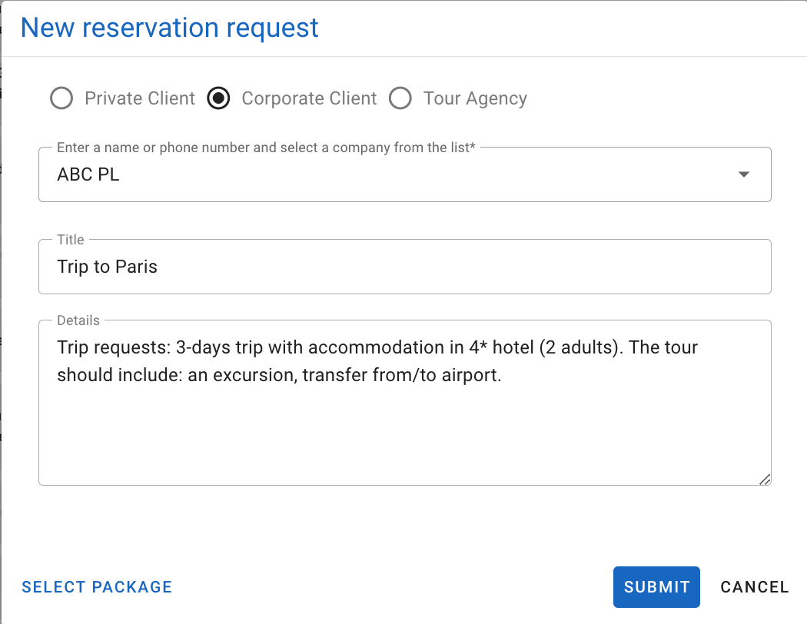
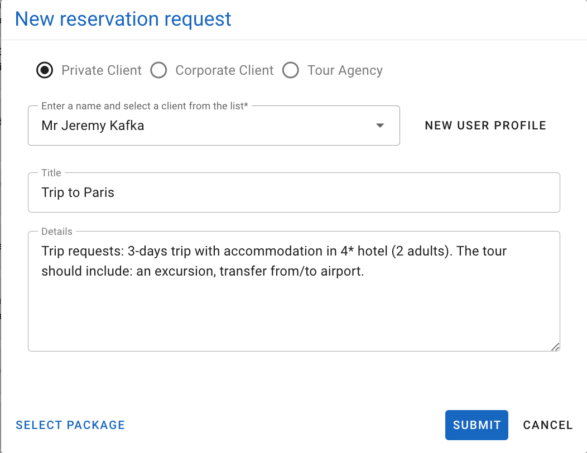

---
layout:
  width: default
  title:
    visible: true
  description:
    visible: false
  tableOfContents:
    visible: true
  outline:
    visible: true
  pagination:
    visible: true
  metadata:
    visible: true
---

# Create New Reservation

There are several ways to create a new reservation:



General way to create a new reservation request

* On the Reservations menu, click **View reservations**, and then click **New reservation request**.

<figure><figcaption></figcaption></figure>

* Specify the required information in the New reservation request window.

<figure><figcaption></figcaption></figure>



Alternative way to create a new reservation request

* On the Reservations menu, click **New reservation request**.

<figure><figcaption></figcaption></figure>

* Specify the required information in the New reservation request window.



Create a new reservation request for an agent only

* On the Reservations menu, click **Search\&Book for Agent**.

<figure><figcaption></figcaption></figure>

* Select the required agency: locate the mouse pointer into the box. The system will display a list of suggested agencies arranged alphabetically. If you do not see the required item in the list, click **Continue** to proceed.
* Choose the required user: locate the mouse pointer into the box. The system will display a list of suggested users. Click **Continue** to proceed.
* The **reservation for agent** page appears.



Create a new reservation request for a corporate client only

* On the Reservations menu, click **Search\&Book for a Corporate Client**.

<figure><figcaption></figcaption></figure>

* Select the client. The system will display a list of suggested clients arranged alphabetically. If you do not see the required item in the list, click **Continue** to proceed.
* The **reservation for agent** page appears.

<figure><figcaption></figcaption></figure>

* Fill the form by analogy with previous steps.


